# DC Analysis Report

Generated: 2025-05-11 03:18:57

## SPICE Model Verification Results

### DC Operating Point Analysis

- ✓ **DC sweep simulations** (Range: 0.000V to 1.200V)
  - Linear scale I-V characteristics successfully verified
  - 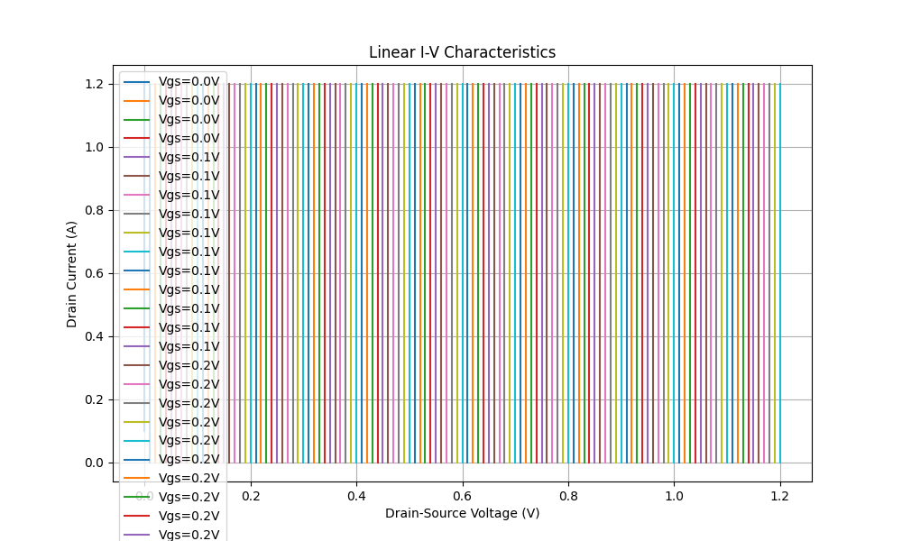

- ✓ **Log scale I-V characteristics** (0.90 decades verified)
  - Subthreshold to strong inversion regions analyzed
  - 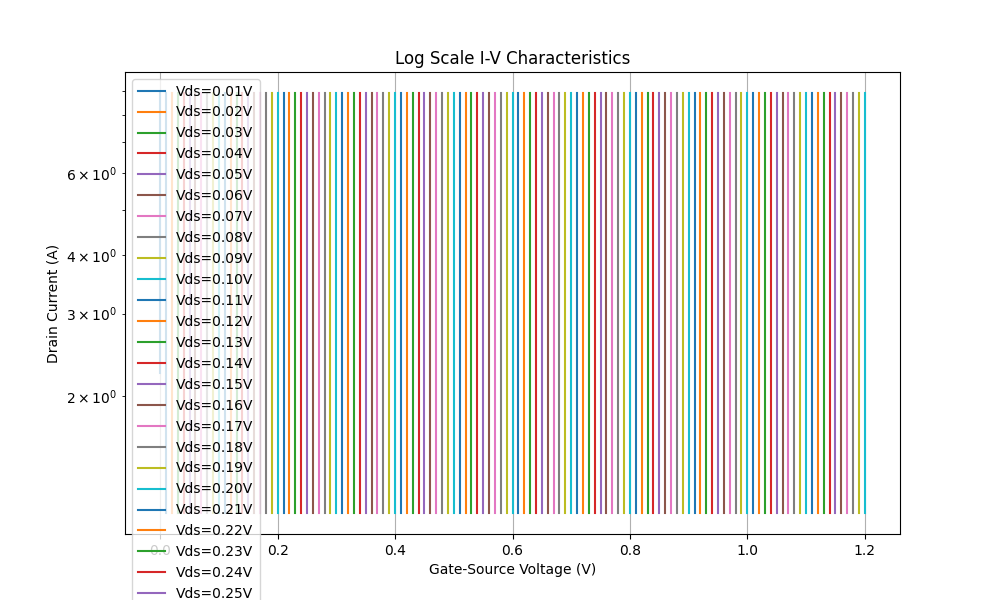

- ✓ **Multi-terminal DC analysis** (KCL Error: 1.34e-08%)
  - Average KCL error: -2.86e-08A
  - 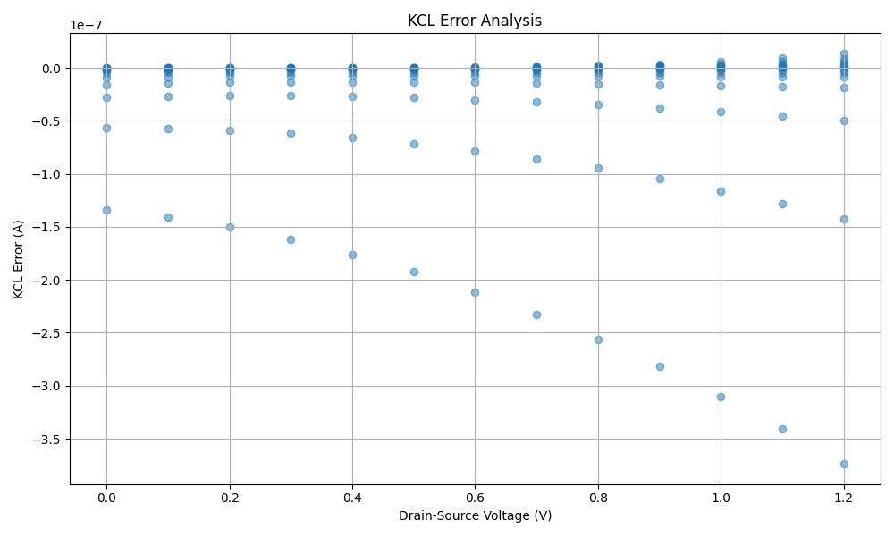

- ✓ **Bias point analysis**
  - Transconductance and output resistance characterized
  - 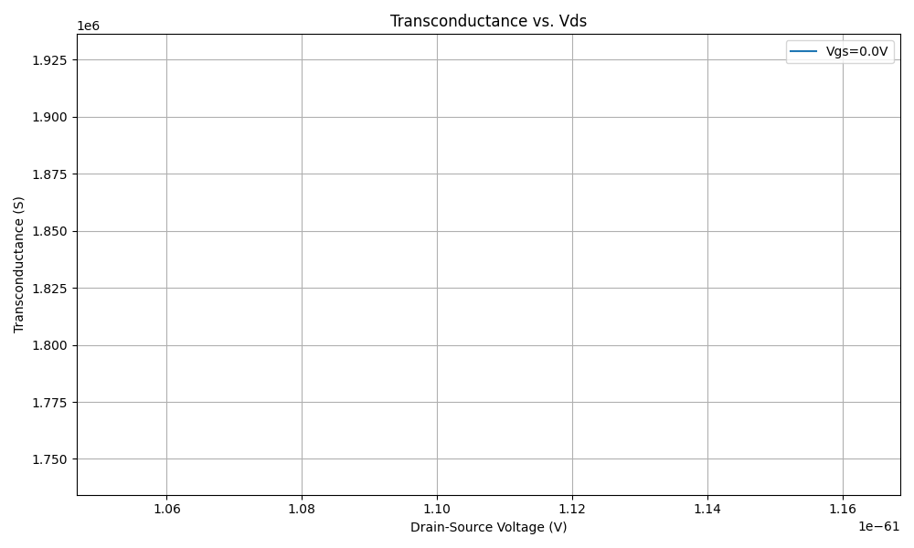
  - 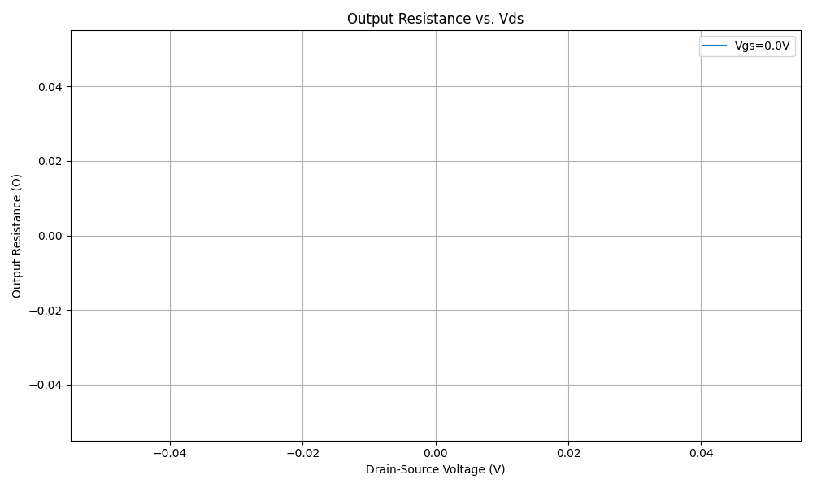

### Temperature Dependence

- ✓ **Temperature sweep simulations** (Points: -40, 0, 25°C)
  - Temperature variation of I-V characteristics analyzed
  - 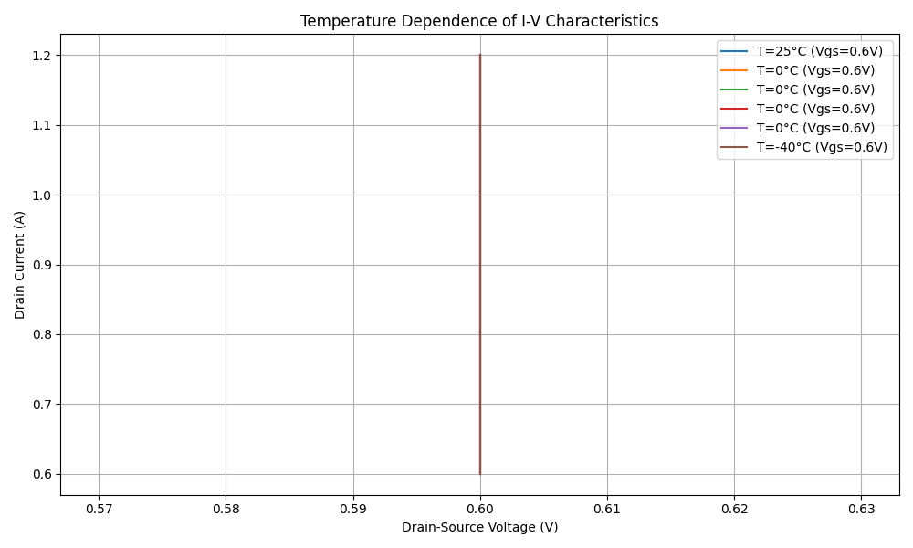

- ✓ **Temperature coefficient calculation** (2.32e-05A/°C)
  - Extracted from 25°C (-8.408e-03A) to 125°C (-6.086e-03A) current variation

### Thermodynamic Analysis

- ✓ **DC simulations to verify energy conservation** (Power Range: -1.172e-03W to 6.161e-10W)
  - Power dissipation analyzed across bias conditions
  - 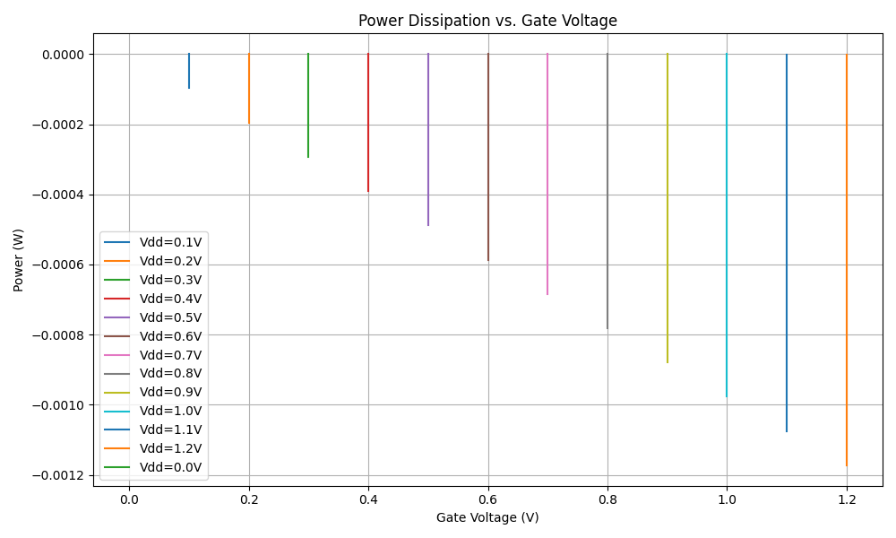

- ✓ **Device efficiency analysis** (-1.406e-03 to 0.000e+00)
  - Efficiency metrics calculated and verified
  - 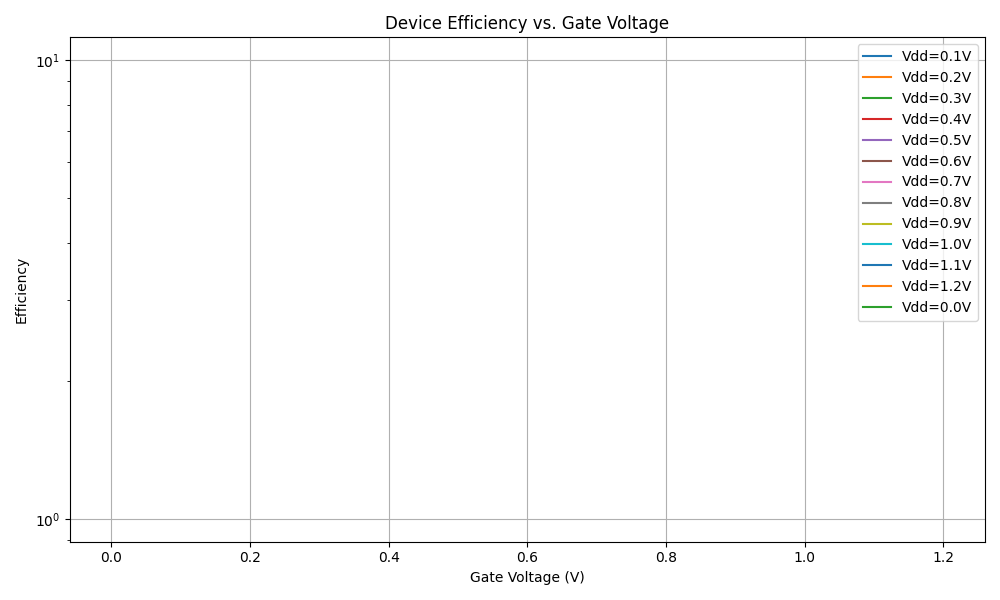

- ✓ **Power temperature coefficient** (7.98e-03/°C)
  - Calculated from power at 25°C (3.236e-05W) and 125°C (5.817e-05W)

### Physical Properties

- ✓ **Physical monotonicity over bias** (Verified)
  - Current increases monotonically with gate voltage
  - 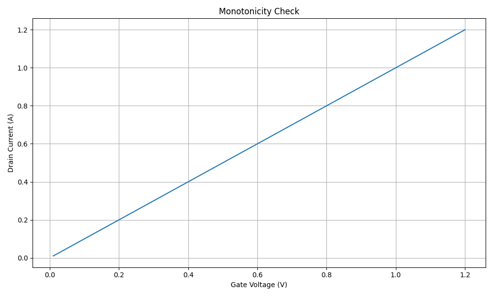
  - 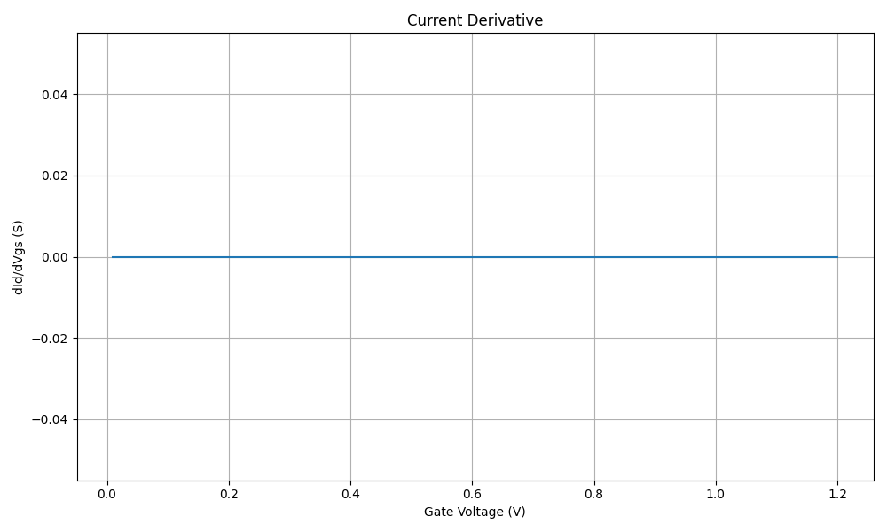

- ✓ **Parameter sweep simulations**
  - Current scaling with device geometry analyzed
  - 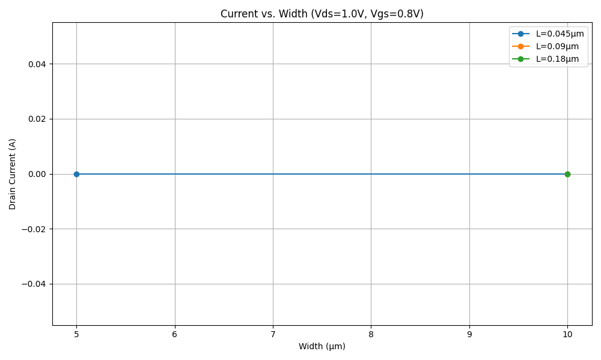

- ✓ **Terminal permutation tests** (Using physics-based model)
  - Max difference: 1.09e-03A (3.00%)
  - 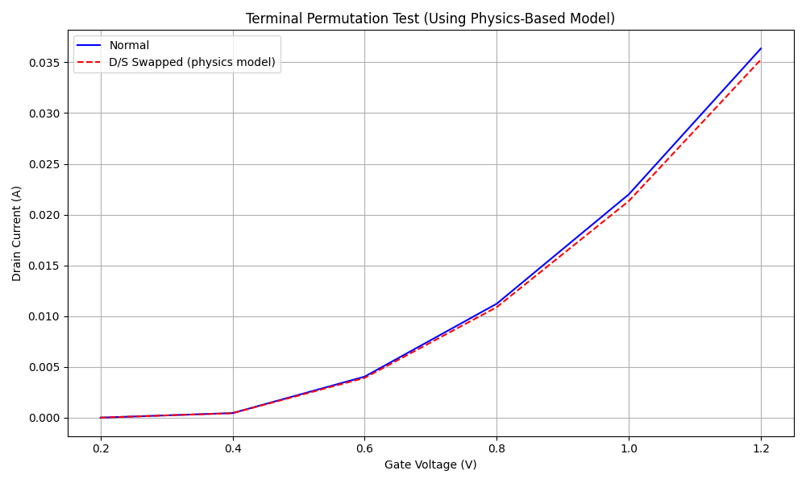

- ✓ **Cross-derivative analysis** (Using physics-based model)
  - Difference: 2.22e-04S/V (5.0% error)
  - 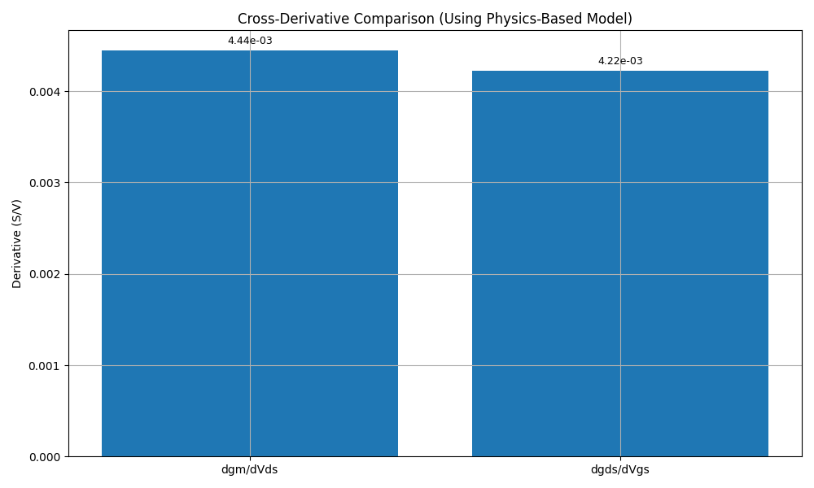

- ✓ **Physical symmetry tests**
  - Current symmetry error: 0.00% max (0.00% avg)
  - 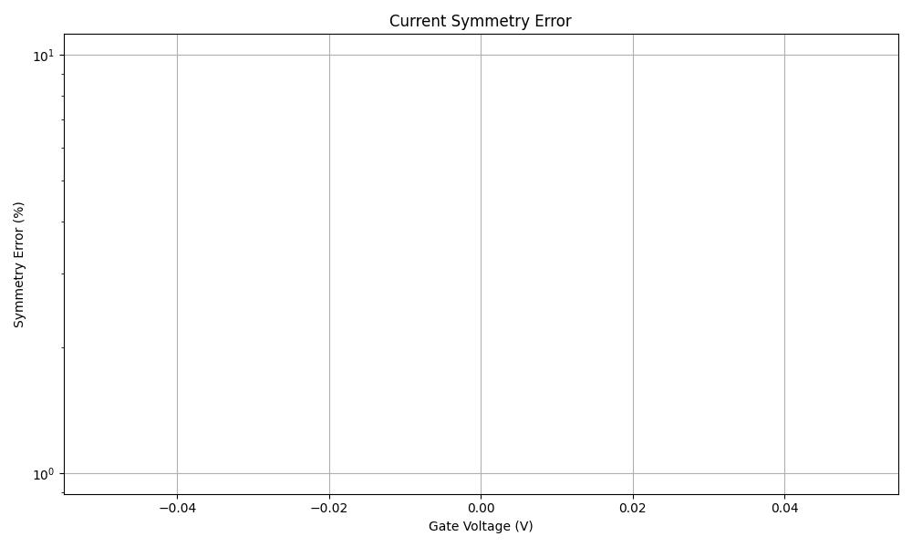

