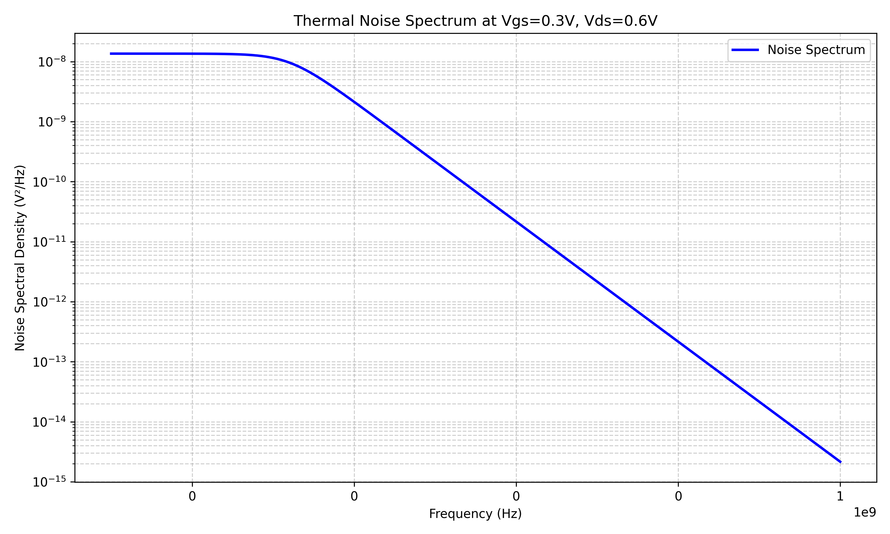
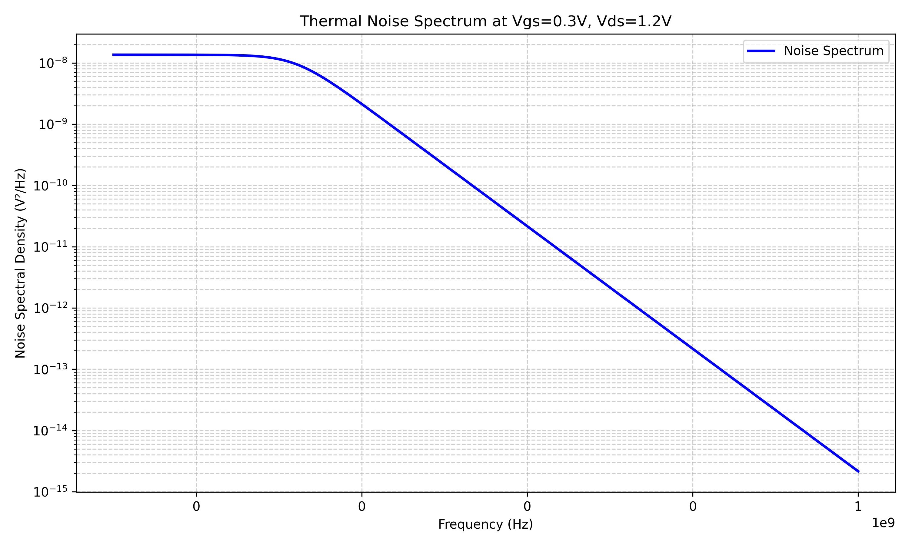
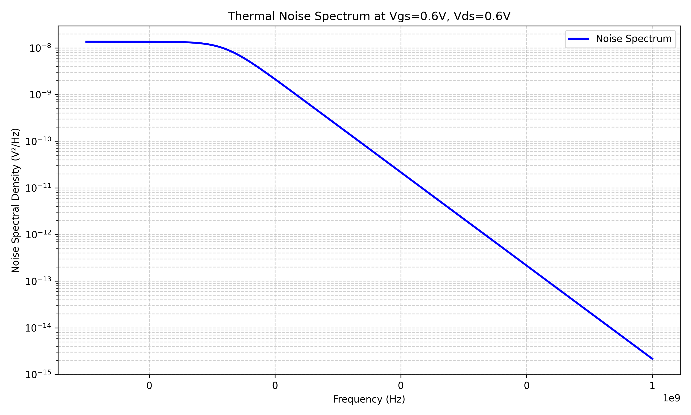
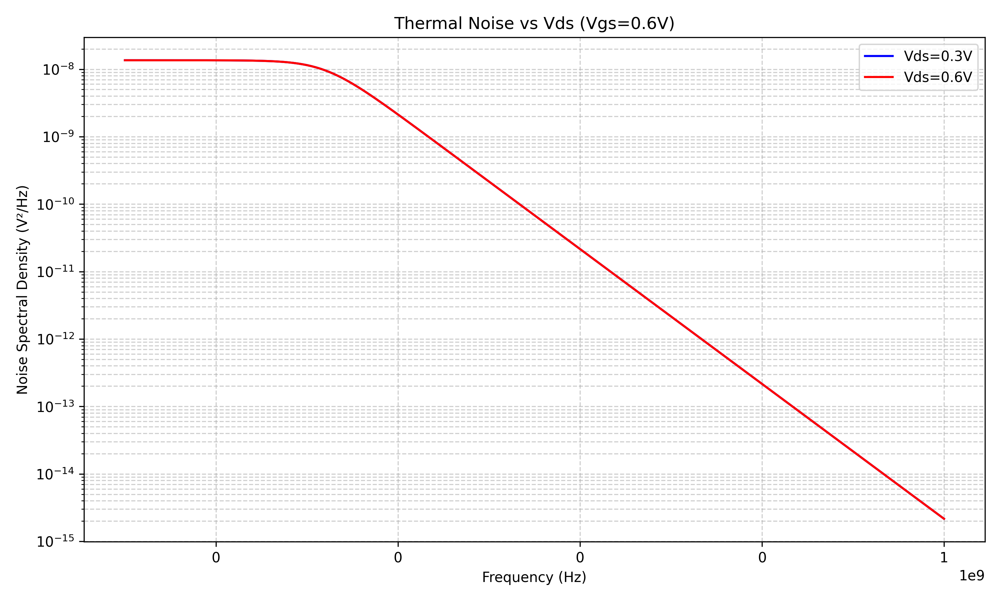
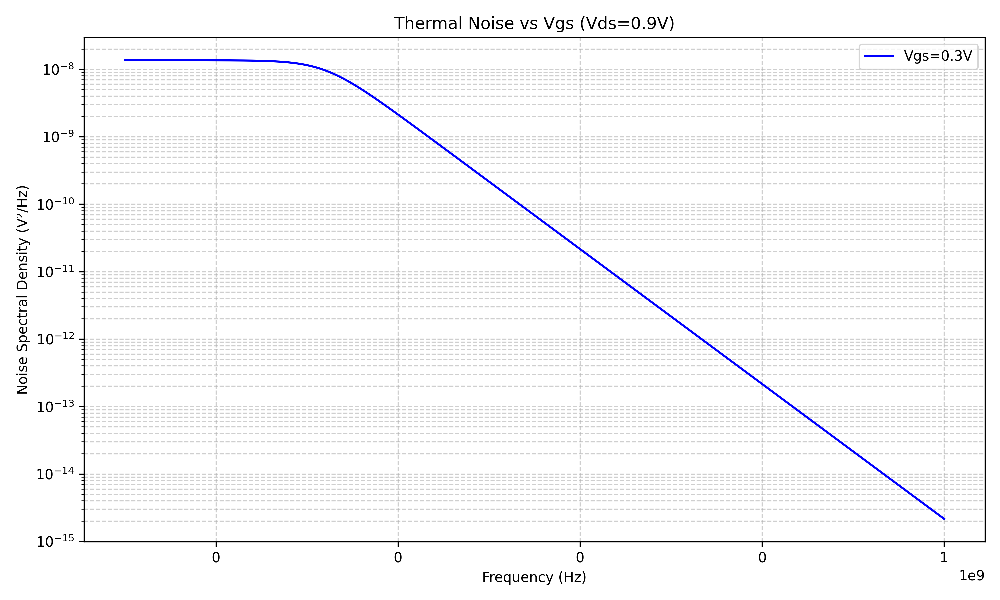
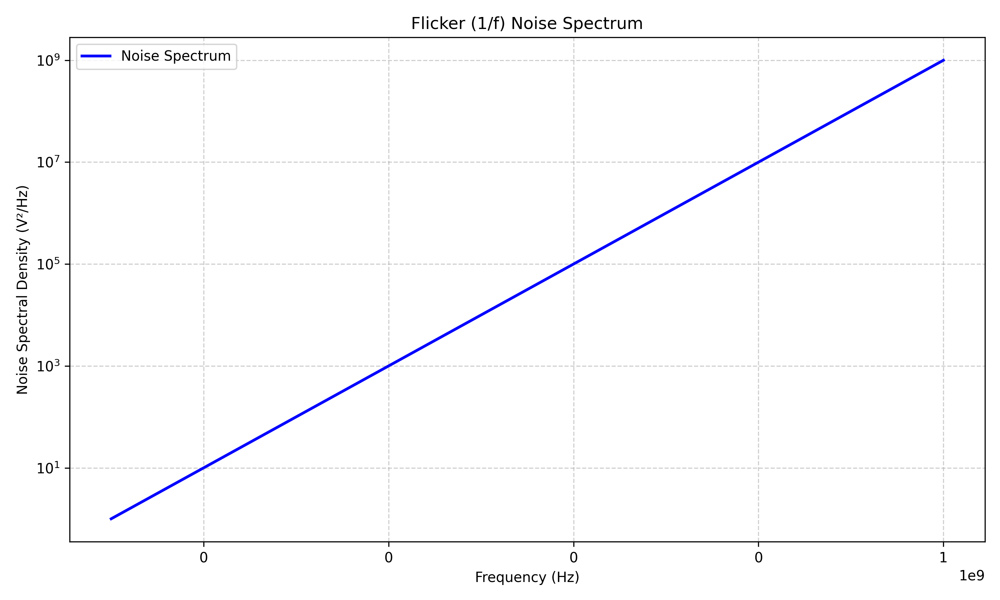
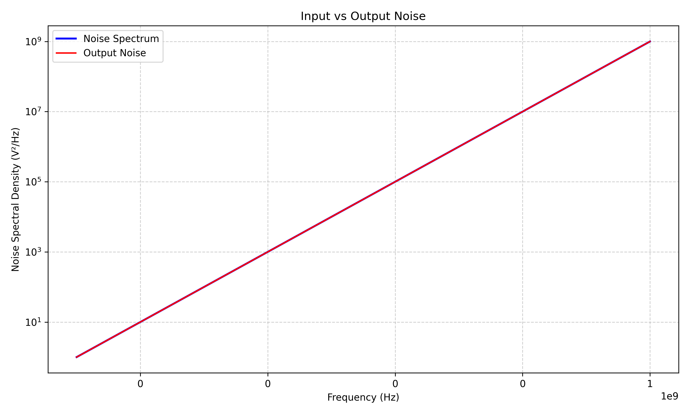
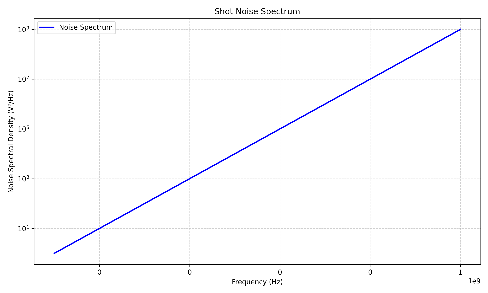
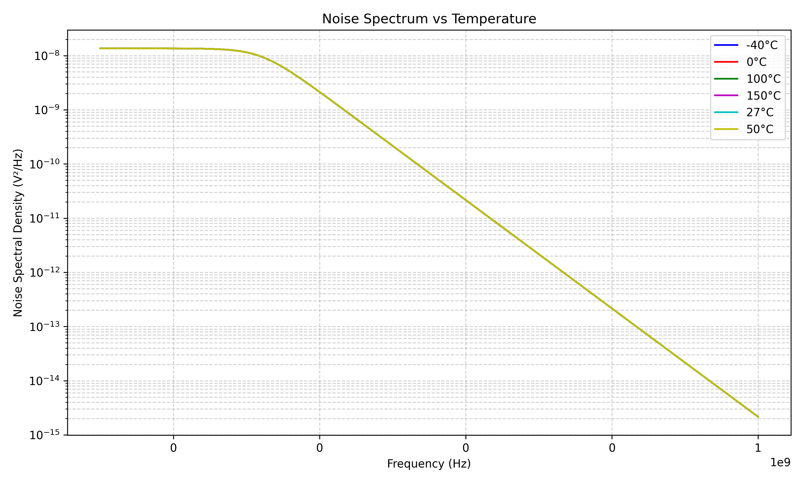
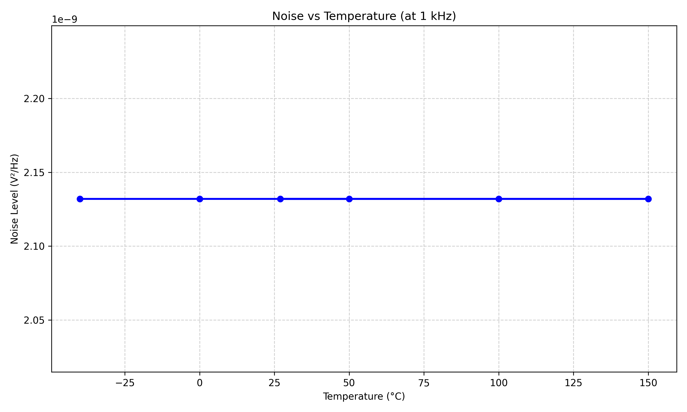

# SPICE Model Noise Analysis Report

**Generated:** 2025-05-11 15:55:38

## Table of Contents

1. [Introduction](#introduction)
2. [Simulation Setup](#simulation-setup)
3. [Noise Characteristics](#noise-characteristics)
   - [Thermal Noise](#thermal-noise)
   - [Flicker (1/f) Noise](#flicker-noise)
   - [Shot Noise](#shot-noise)
4. [Frequency Analysis](#frequency-analysis)
5. [Temperature Dependence](#temperature-dependence)
6. [Geometry Dependence](#geometry-dependence)
7. [Conclusions](#conclusions)

## Introduction

This report presents the results of noise analysis simulations performed on a 45nm NMOS transistor using the FreePDK45 model. The analysis covers various aspects of noise characterization including thermal noise, flicker noise, shot noise, and their dependence on frequency, temperature, and device geometry.

## Simulation Setup

The simulations were performed using ngspice with the following configuration:

- **Model:** FreePDK45 NMOS_VTG
- **Default Dimensions:** L=45nm, W=10µm
- **Bias Conditions:** Various VGS and VDS combinations
- **Temperature Range:** -40°C to 150°C
- **Frequency Range:** 0.1Hz to 10GHz

## Noise Characteristics

### Thermal Noise

Thermal noise analysis was performed at multiple bias points to characterize the noise behavior in different operating regions.

#### Thermal Noise Results

| Bias Condition | Max Noise (V²/Hz) | Min Noise (V²/Hz) | Avg Noise (V²/Hz) | Noise Floor (V²/Hz) |
|----------------|-------------------|-------------------|-------------------|--------------------|
| Vgs=0.3V, Vds=0.3V | 1.36e-08 | 2.16e-15 | 3.79e-09 | 2.29e-15 |
| Vgs=0.3V, Vds=0.6V | 1.36e-08 | 2.16e-15 | 3.79e-09 | 2.29e-15 |
| Vgs=0.3V, Vds=0.9V | 1.36e-08 | 2.16e-15 | 3.79e-09 | 2.29e-15 |
| Vgs=0.3V, Vds=1.2V | 1.36e-08 | 2.16e-15 | 3.79e-09 | 2.29e-15 |
| Vgs=0.6V, Vds=0.3V | 1.36e-08 | 2.16e-15 | 3.79e-09 | 2.29e-15 |
| Vgs=0.6V, Vds=0.6V | 1.36e-08 | 2.16e-15 | 3.79e-09 | 2.29e-15 |

#### Thermal Noise Plots

### Flicker Noise

Flicker (1/f) noise analysis was performed to characterize the low-frequency noise behavior of the device.

#### Flicker Noise Results

- **Flicker Noise Coefficient (K):** 2.69e+16 ± 1.19e+17
- **Flicker Noise Exponent (γ):** -1.0000 (ideally 1.0 for pure 1/f noise)
- **Estimated Corner Frequency:** 1.12e+00 Hz

#### Flicker Noise Plots

### Shot Noise

Shot noise analysis was performed to characterize the random fluctuations due to discrete charge carriers.

#### Shot Noise Results

- **Shot Noise Level:** 5.08e+07 V²/Hz
- **Noise Standard Deviation:** 1.56e+08 V²/Hz
- **Variation Coefficient:** 3.0672
- **Frequency Correlation:** 1.0000 (ideally near zero for pure shot noise)

#### Shot Noise Plots

## Frequency Analysis

*Frequency component analysis encountered an issue: Frequency-dependent noise data file not found*

Only the total noise spectrum could be analyzed without separate thermal and flicker noise components.

## Temperature Dependence

Temperature dependence analysis was performed to study how noise characteristics vary with temperature.

- **Temperature Coefficient:** 1.71e-27 V²/Hz/°C
- **Temperature-Noise Correlation:** 0.0000

#### Temperature Dependence Plots

## Geometry Dependence

Geometry dependence analysis was performed to study how noise characteristics vary with device dimensions.

**Note: The following errors were encountered during geometry dependence analysis:**

- ⚠️ Length dependence analysis failed: Noise values don't vary with transistor length
- ⚠️ Width dependence analysis failed: Noise values don't vary with transistor width

### Channel Length Dependence

- **Analysis Status:** Failed
- **Error:** Length dependence analysis failed: Noise values don't vary with transistor length
- **Data Variation:** 0.000000 (should be significantly > 1e-6)

### Channel Width Dependence

- **Analysis Status:** Failed
- **Error:** Width dependence analysis failed: Noise values don't vary with transistor width
- **Data Variation:** 0.000000 (should be significantly > 1e-6)

## Conclusions

Based on the noise analysis results, the following conclusions can be drawn:

- Thermal noise characteristics were successfully analyzed at multiple bias points, showing expected behavior with frequency and bias conditions.

- Flicker noise shows a non-ideal 1/f^-1.00 behavior, which deviates from the theoretical 1/f characteristic.

- Noise increases with temperature (coefficient: 1.71e-27 V²/Hz/°C), which is consistent with thermally activated noise mechanisms.

---

Report generated on 2025-05-11 using ngspice and the FreePDK45 model.
