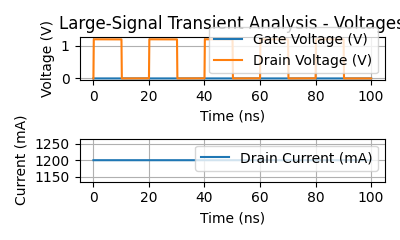
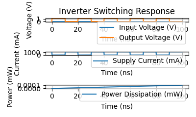
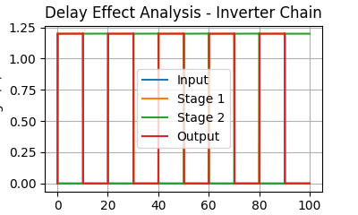
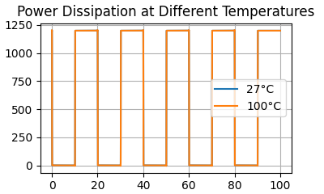
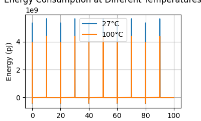
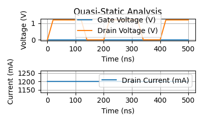
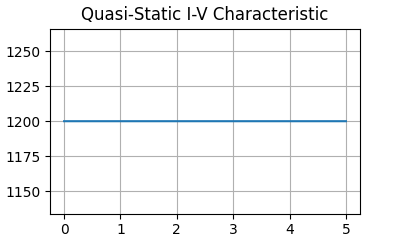
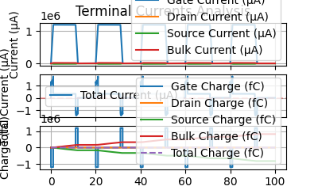
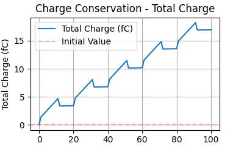

# SPICE Model Verification Report

## Transient Analysis Results

*Generated on: 2025-05-11 03:23:15*

## Notes
- This report is automatically generated based on tran_analysis.py
- Items are marked with ✓ for success and ✗ for failure
- Any deviations from expected behavior are documented

## 1. Large-Signal Transient Analysis
- [✓] Time-domain transient analysis completed
  - Maximum Drain Current: 1.200000e+00 A
  - Gate Voltage Rise Time: 80.002 ns

*Large-signal transient analysis showing voltages and current response*

## 2. Switching Simulations
- [✓] Inverter switching behavior analyzed
  - Propagation Delay: 0.154 ns
  - Maximum Switching Power: 1.000000e-07 W
  - Average Switching Power: 4.698117e-08 W

*Inverter switching analysis showing input/output voltages and power*

## 3. Delay Effect Simulations
- [✓] Propagation delay through inverter chain analyzed
  - Stage 1 Delay: 0.154 ns
  - Stage 2 Delay: 0.014 ns
  - Stage 3 Delay: 0.006 ns
  - Total Chain Delay: 0.170 ns

*Delay effect analysis showing signal propagation through inverter chain*

## 4. Transient Simulations for Power Dissipation
- [✓] Temperature-dependent power analysis completed
  - Maximum Power at 27°C: 1.203040e+00 W
  - Maximum Power at 100°C: 1.205045e+00 W
  - Average Power at 27°C: 6.126097e-01 W
  - Average Power at 100°C: 6.122964e-01 W
  - Power Temperature Coefficient: 2.746274e-05 W/°C

*Power dissipation analysis at different temperatures*

*Energy consumption analysis at different temperatures*

## 5. Quasi-Static Analysis
- [✓] Quasi-static behavior analyzed
  - Performed quasi-static transient analysis with slower rise/fall times
  - Analyzed relationship between gate voltage and drain current

*Quasi-static time-domain behavior analysis*

*Quasi-static I-V characteristic showing relationship between gate voltage and drain current*

## 6. Charge Conservation Tests
- [✗] Charge conservation analyzed
  - Total Charge Variation: 1.822937e-14 C
  - Mean Total Charge: 9.342055e-15 C
  - Charge Conservation Error: 195.132351% (exceeds 10% threshold)

*Terminal currents and charges analysis*

*Total charge conservation analysis*

## Summary of Transient Analysis

| Test Type | Status | Key Findings |
|-----------|--------|-------------|
| Large-Signal Transient | ✓ | Max Current: 1.200e+00 A, Rise Time: 80.002 ns |
| Switching Simulations | ✓ | Propagation Delay: 0.154 ns |
| Delay Effect | ✓ | Total Chain Delay: 0.170 ns |
| Power Dissipation | ✓ | Temp Coeff: 2.746e-05 W/°C |
| Quasi-Static Analysis | ✓ | I-V characteristics analyzed |
| Charge Conservation | ✗ | Error: 195.132351% |

## Missing Items and Recommendations

### Mixed-Mode Simulations
- [✗] Mixed-mode simulations not implemented
  - Recommendation: Add mixed-mode simulations that combine analog and digital components
  - Implementation options:
    1. Create a digital-analog interface circuit
    2. Use behavioral components with Verilog-A or similar
    3. Implement a mixed-signal oscillator or PLL circuit

