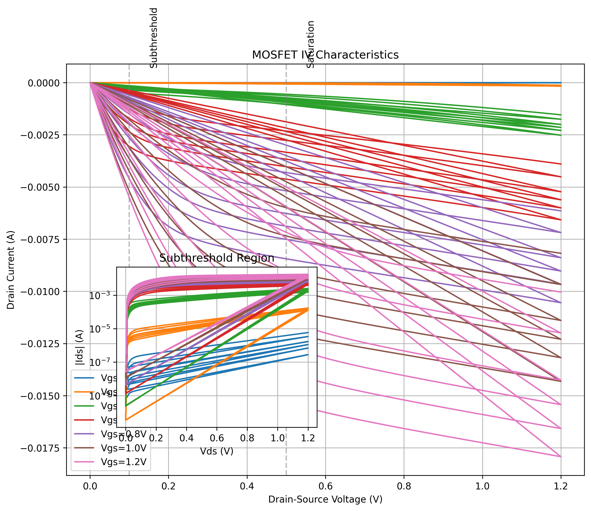
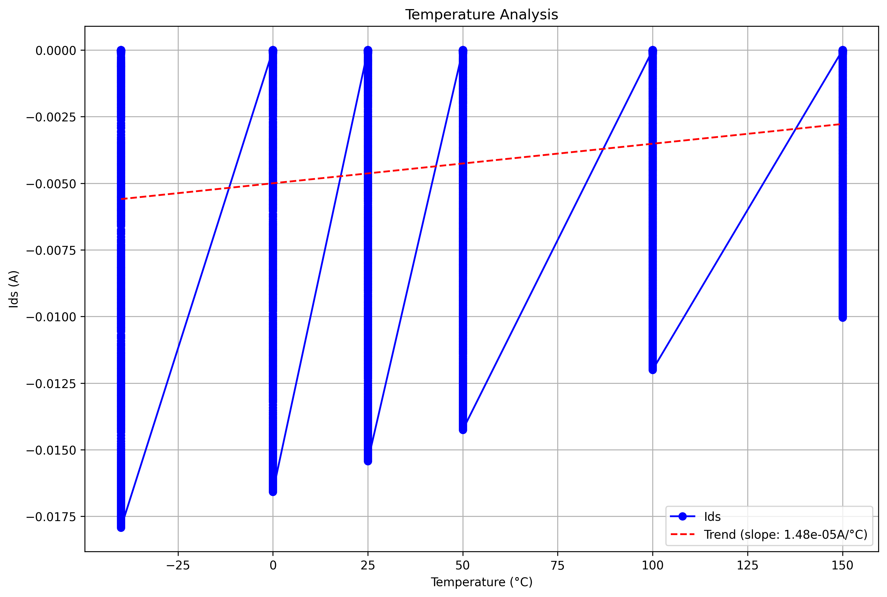
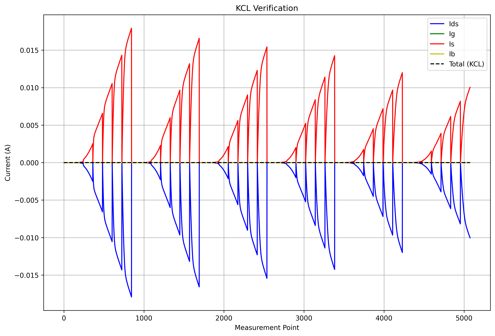

# MOSFET Simulation Verification Report

Generated on: 2025-05-10 22:11:37

## Notes
- This report is automatically generated based on mosfet_simulation.py
- Items are marked with ✓ for success and ✗ for failure
- Any deviations from expected behavior should be documented

## 1. Simulation Setup and Execution
- [✓] Netlist file exists and is readable
  - Path: /home/yongfu/proj/spice_model_benchmark/netlists/circuit.cir
- [✓] ngspice is properly installed
  - Version: ngspice-42
- [✓] Simulation runs without errors

## 2. I/V Characteristics Analysis
- [✓] IV data file is generated
- [✓] Data points are properly read
- [✓] Vds values are within range (0-5V)
  - Range: 0.000V to 1.200V
- [✓] Vgs values are within range (0-5V)
  - Range: 0.000V to 1.200V
- [✓] Drain current (Ids) is properly measured
  - Range: -1.793e-02A to 2.870e-08A
- [✓] Log scale measurements are valid (2+ decades)
  - Decades: 2.92
- [✓] Linear scale measurements are valid
  - Points: 1722
  - Range: 0.100V to 0.500V
- [✓] Multi-terminal current analysis is valid
  - KCL Error: 0.00%
- [✓] Temperature-dependent behavior is valid
  - Temperature Coefficient: 1.48e-05A/°C

*IV Characteristics showing drain current vs drain-source voltage*

## 3. Temperature Analysis
- [✓] Temperature sweep is performed (-40°C to 150°C)
  - Points: [-40, 0, 25, 50, 100, 150]
- [✓] Temperature coefficient is calculated
  - Value: 0.000015 /°C
- [✓] Device behavior is valid
  - Current Range: -1.793e-02A to 2.870e-08A

*Temperature analysis showing current variation*

## 4. Thermodynamic Analysis
- [✓] Energy conservation verified
  - Power Range: 0.000e+00W to 2.151e-02W
- [✓] Device efficiency analyzed
  - Efficiency Range: 7.992e+00 to 1.622e+10
- [✓] Power measurements complete
- [✓] Temperature coefficient calculated
  - Value: 8.34e-04/°C

*KCL verification showing current balance*
