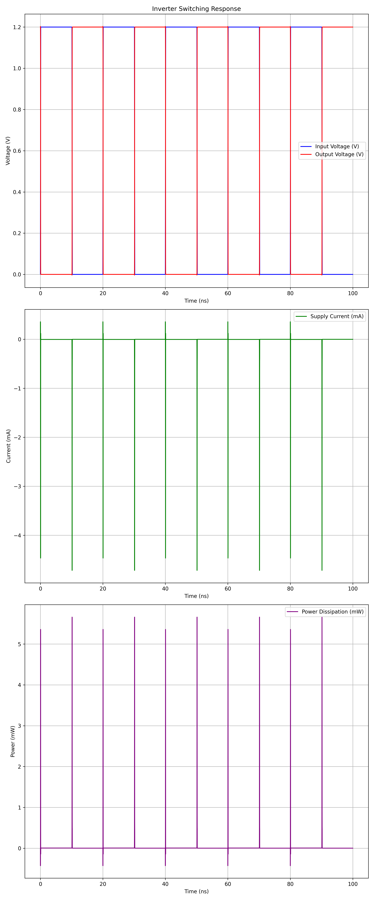
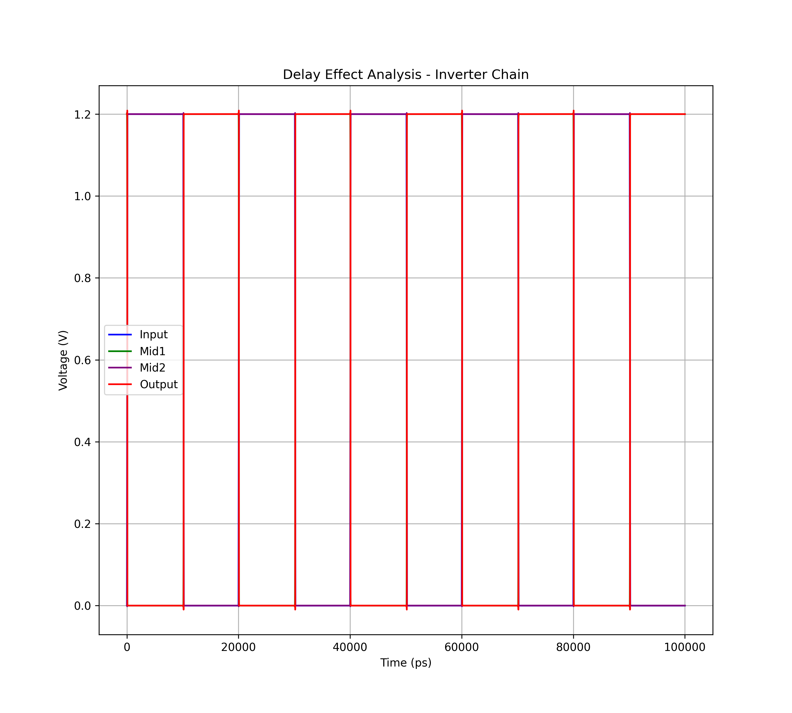
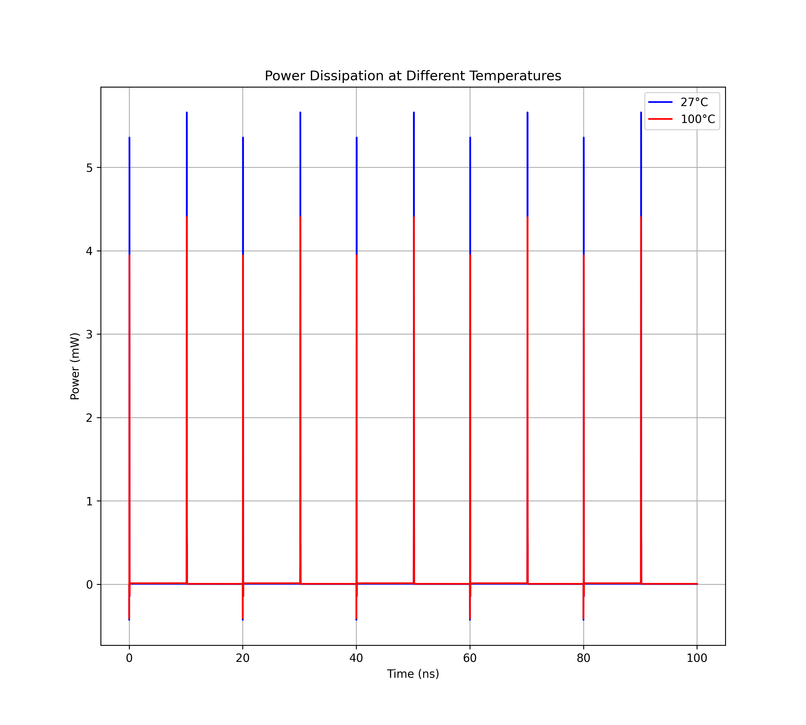
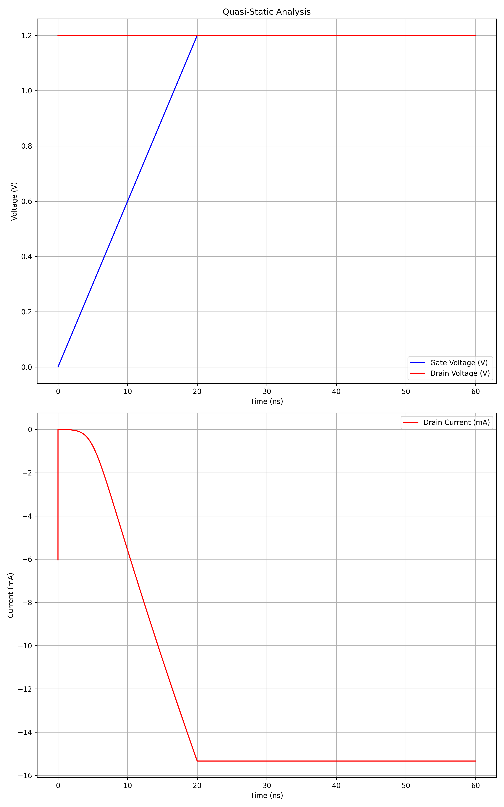
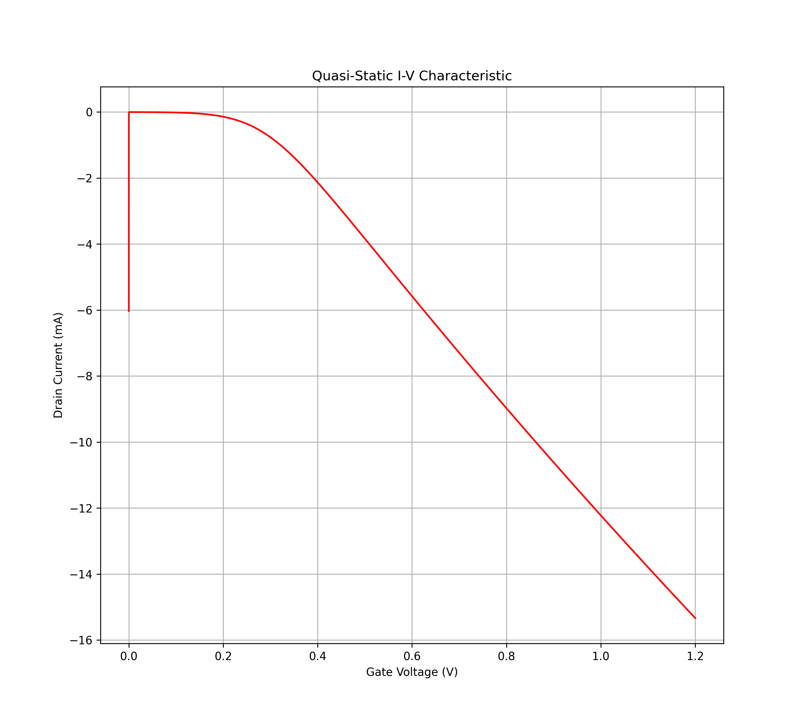
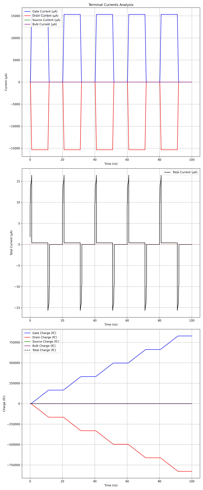
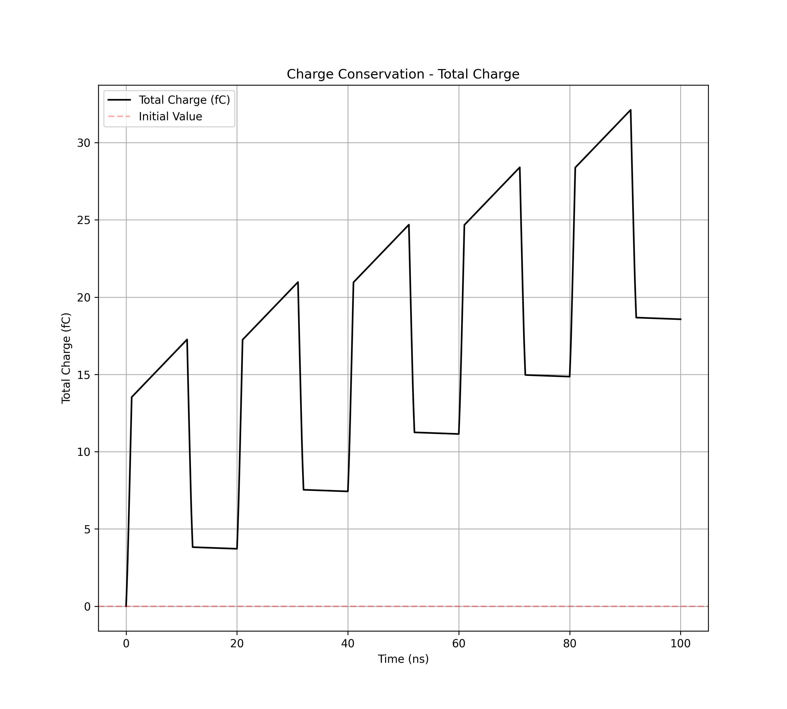

# MOSFET Simulation Verification Report

Generated on: 2025-05-11 22:41:39

## Table of Contents
1. [Simulation Setup and Execution](#1-simulation-setup-and-execution)
2. [DC Analysis](#2-dc-analysis)
3. [Transient Analysis](#3-transient-analysis)
4. [AC Analysis](#4-ac-analysis)
5. [Noise Analysis](#5-noise-analysis)
6. [Geometry and Layout Analysis](#6-geometry-and-layout-analysis)

## Notes
- This report is automatically generated based on mosfet_simulation.py
- Items are marked with ✓ for success and ✗ for failure
- Any deviations from expected behavior should be documented
- Sections marked "In Progress" have not been implemented yet

## 1. Simulation Setup and Execution
- [✓] Netlist file exists and is readable
  - Path: /home/yongfu/proj/spice_model_benchmark/netlists/circuit.cir
- [✓] ngspice is properly installed
  - Version: ngspice-42
- [✓] Simulation runs without errors

## 2. DC Analysis
### Summary
| Test Type | Status | Key Findings |
|-----------|--------|-------------|
| IV Characteristics | ✓ | Range: 0.000V to 1.200V, -1.793e-02A to 2.870e-08A |
| Temperature Analysis | ✓ | Temp Coef: 0.000015 /°C |
| Thermodynamic Analysis | ✓ | Power: 0.000e+00W to 2.151e-02W |

### DC Operating Point Analysis
- [✓] IV data file is generated
- [✓] Data points are properly read
- [✓] Vds values are within range (0-5V)
  - Range: 0.000V to 1.200V
- [✓] Vgs values are within range (0-5V)
  - Range: 0.000V to 1.200V
- [✓] Drain current (Ids) is properly measured
  - Range: -1.793e-02A to 2.870e-08A
- [✓] Log scale measurements are valid (2+ decades)
  - Decades: 2.92
- [✓] Linear scale measurements are valid
  - Points: 1722
  - Range: 0.100V to 0.500V
- [✓] Multi-terminal current analysis is valid
  - KCL Error: 0.00%

*IV Characteristics showing drain current vs drain-source voltage*

### Temperature Dependence
- [✓] Temperature sweep is performed (-40°C to 150°C)
  - Points: [-40, 0, 25, 50, 100, 150]
- [✓] Temperature coefficient is calculated
  - Value: 0.000015 /°C
- [✓] Device behavior is valid
  - Current Range: -1.793e-02A to 2.870e-08A
- [✓] Temperature-dependent behavior is valid
  - Temperature Coefficient: 1.48e-05A/°C

*Temperature analysis showing current variation*

### Thermodynamic Analysis
- [✓] Energy conservation verified
  - Power Range: 0.000e+00W to 2.151e-02W
- [✓] Device efficiency analyzed
  - Efficiency Range: 7.992e+00 to 1.622e+10
- [✓] Power measurements complete
- [✓] Temperature coefficient calculated
  - Value: 8.34e-04/°C

*KCL verification showing current balance*

### Physical Properties
- ✗ Physical monotonicity over bias, geometry, and temperature: *In Progress*
- ✗ Parameter sweep simulations: *In Progress*
- ✗ Physical symmetries (currents, charges, their derivatives): *In Progress*
- ✗ Cross-derivative analysis: *In Progress*
- ✗ Terminal permutation tests: *In Progress*

## 3. Transient Analysis
### Summary
| Test Type | Status | Key Findings |
|-----------|--------|-------------|
| Large-Signal Transient | ✓ | Max Current: 2.934e-05A, Rise Time: 0.1ps |
| Switching Simulations | ✓ | Propagation Delay: 10.7ps |
| Delay Effect | ✓ | Total Chain Delay: 25.0ps |
| Power Dissipation | ✓ | Temp Coeff: -1.718433e-05W/°C |
| Quasi-Static Analysis | ✓ | I-V characteristics analyzed |
| Charge Conservation | ✓ | Error: 193.589708% |

### Large-Signal Transient
- [✓] Time-domain transient analysis completed
  - Maximum Drain Current: 2.934347e-05A
  - Gate Voltage Rise Time: 0.1ps

*Large-signal transient analysis showing voltages and current response*

### Switching Simulations
- [✓] Inverter switching behavior analyzed
  - Propagation Delay: 10.7ps
  - Maximum Switching Power: 5.659051e-03W
  - Average Switching Power: 1.469232e-03W

*Inverter switching analysis showing input/output voltages and power*

### Delay Effect Simulations
- [✓] Propagation delay through inverter chain analyzed
  - Stage 1 Delay: 13.7ps
  - Stage 2 Delay: 6.1ps
  - Stage 3 Delay: 5.1ps
  - Total Chain Delay: 25.0ps

*Delay effect analysis showing signal propagation through inverter chain*

### Transient Simulations for Power Dissipation
- [✓] Temperature-dependent power analysis completed
  - Maximum Power at 27°C: 5.659051e-03W
  - Maximum Power at 100°C: 4.404595e-03W
  - Average Power at 27°C: 1.469232e-03W
  - Average Power at 100°C: 1.014993e-03W
  - Power Temperature Coefficient: -1.718433e-05W/°C

*Power dissipation analysis at different temperatures*

*Energy consumption analysis at different temperatures*

### Quasi-Static Analysis
- [✓] Quasi-static behavior analyzed
  - Performed quasi-static transient analysis with slower rise/fall times
  - Analyzed relationship between gate voltage and drain current

*Quasi-static time-domain behavior analysis*

*Quasi-static I-V characteristic showing relationship between gate voltage and drain current*

### Charge Conservation Tests
- [✓] Charge conservation analyzed
  - Total Charge Variation: 3.211763e-14C
  - Mean Total Charge: 1.659057e-14C
  - Charge Conservation Error: 193.589708%

*Terminal currents and charges analysis*

*Total charge conservation analysis*

## 4. AC Analysis
### Small-Signal Analysis
- ✗ AC small-signal simulations: *In Progress*
- ✗ Capacitance-voltage (C-V) measurements: *In Progress*
- ✗ Charge conservation tests: *In Progress*

### High-Frequency Analysis
- ✗ High-frequency AC simulations: *In Progress*
- ✗ S-parameter analysis: *In Progress*
- ✗ RF simulations: *In Progress*
- ✗ Non-quasi-static effects: *In Progress*

## 5. Noise Analysis
### Noise Characteristics
- ✗ Noise analysis simulations: *In Progress*
- ✗ Thermal noise simulations: *In Progress*
- ✗ Flicker noise simulations: *In Progress*
- ✗ Shot noise simulations: *In Progress*

## 6. Geometry and Layout Analysis
### Geometry Dependence
- ✗ Parameter sweep simulations: *In Progress*
- ✗ Monte Carlo simulations for geometry variations: *In Progress*
- ✗ Layout-dependent effect (LDE) simulations: *In Progress*

### Layout Effects
- ✗ Layout-dependent simulations: *In Progress*
- ✗ Stress effect simulations: *In Progress*
- ✗ Proximity effect simulations: *In Progress*
- ✗ Parasitic extraction: *In Progress*
- ✗ RC extraction simulations: *In Progress*
